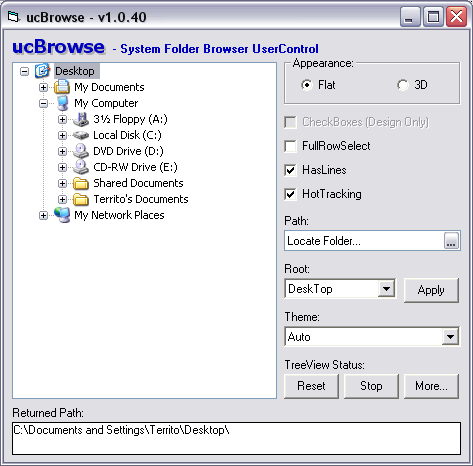



## ucBrowse \- Theme\-Aware Browse for Folder Control

### Description

ucBrowse - Theme-Aware Browse for Folder Control

ucBrowse is a single file, self-subclassed sited (Form Bound) Browse for Folder replacement control which supports customization. Each control supports the following independent properties: Appearance (Flat, 3D), CheckBoxes, FullRowSelect, HasLines, HotTracking, Path, Root and Theme Detection (Auto, Classic, Blue, HomeStead, and Metallic, None). As a bonus, this submission also includes a Theme Aware version of ucPickBox, which is a self-subclassed Theme-Aware control which wraps up the Browse for Folder, Color, SaveAs, Open and Printer dialogs (see PCS ID 63905). So, if your project needs a Browse for Folder functionality while remaining sited on a form, then this control might be just what the doctor ordered. [Update 16Oct07] Added Unicode support for OS &gt;= Win2K, added HideSelection property (Default = True) to remedy focus management issues, added HasButtons property to allow simple line styles. [Update 28Oct07] Added IsFolder and IsFile support, fixed minor bug in QualifyPath which incorrectly added a backslash to file paths (thanks Ruturaj for catching this!).

Enjoy!! TerriTop&#8230;
 
### More Info
 

             |
---                |---
**Submitted On**   |2007-10-28 20:35:08
**By**             |[TerriTop](https://github.com/Planet-Source-Code/PSCIndex/blob/master/ByAuthor/territop.md)
**Level**          |Advanced
**User Rating**    |5.0 (105 globes from 21 users)
**Compatibility**  |VB 6\.0
**Category**       |[Custom Controls/ Forms/  Menus](https://github.com/Planet-Source-Code/PSCIndex/blob/master/ByCategory/custom-controls-forms-menus__1-4.md)
**World**          |[Visual Basic](https://github.com/Planet-Source-Code/PSCIndex/blob/master/ByWorld/visual-basic.md)
**Archive File**   |[ucBrowse\_\-20887810282007\.zip](https://github.com/Planet-Source-Code/territop-ucbrowse-theme-aware-browse-for-folder-control__1-69481/archive/master.zip)

